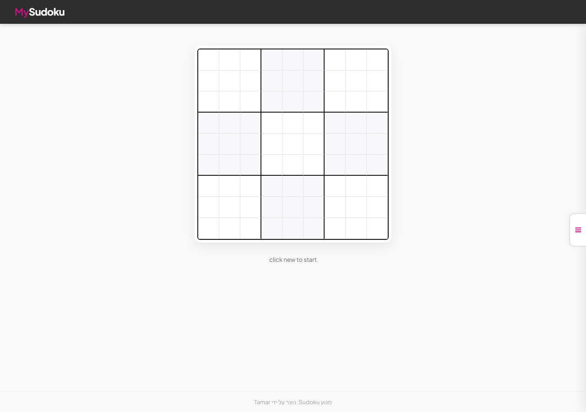
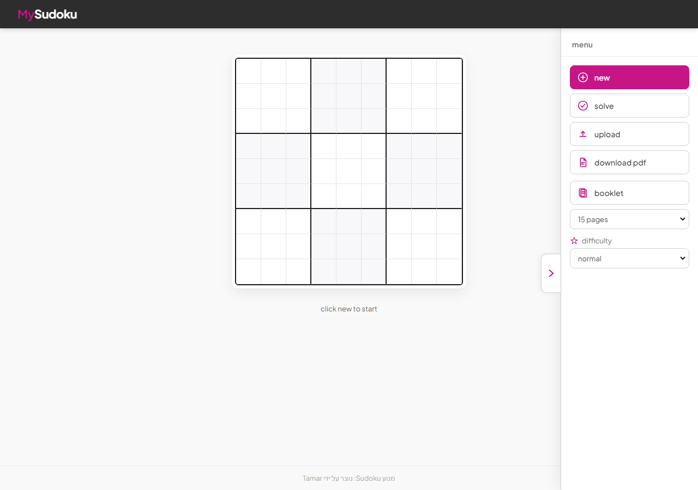
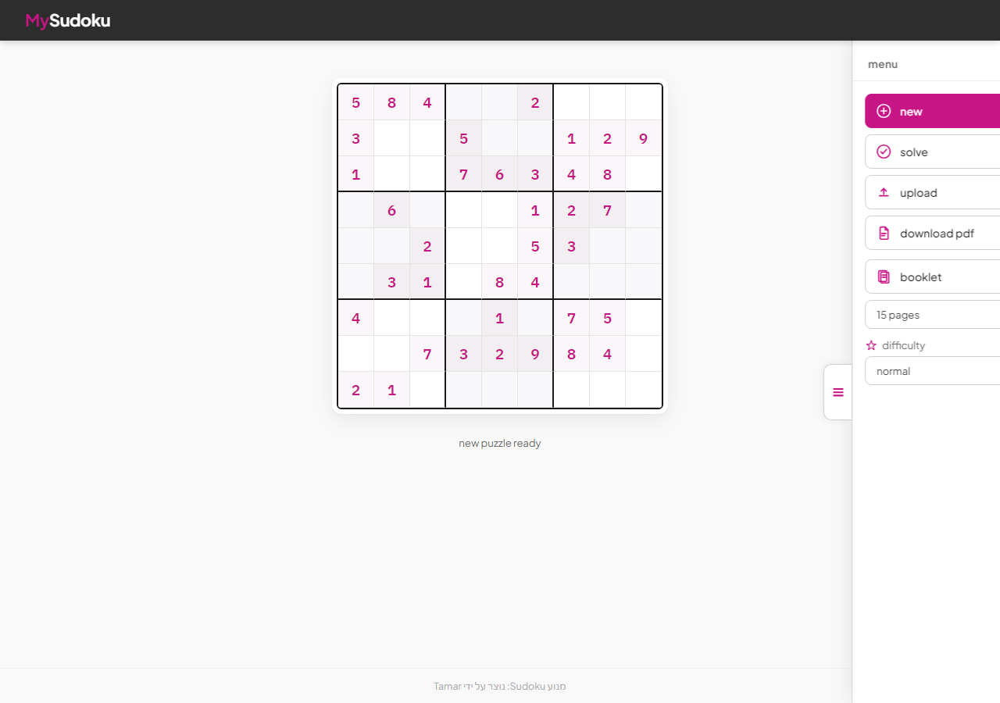
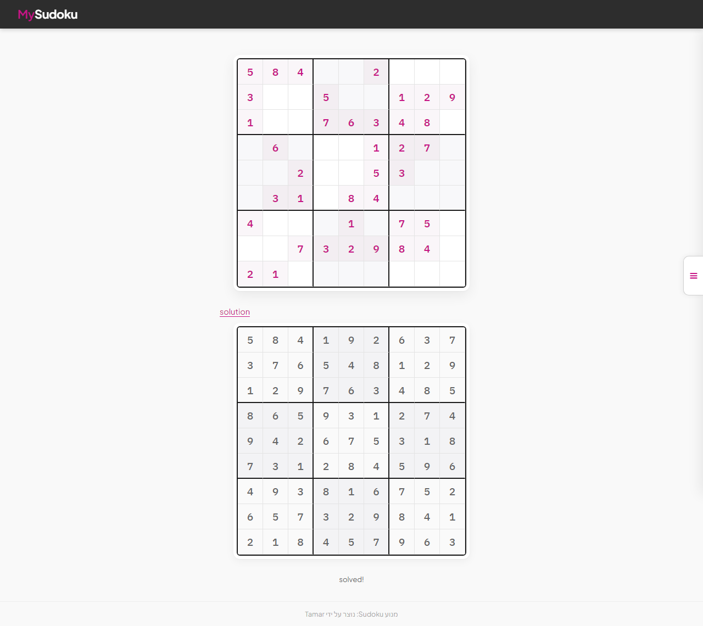
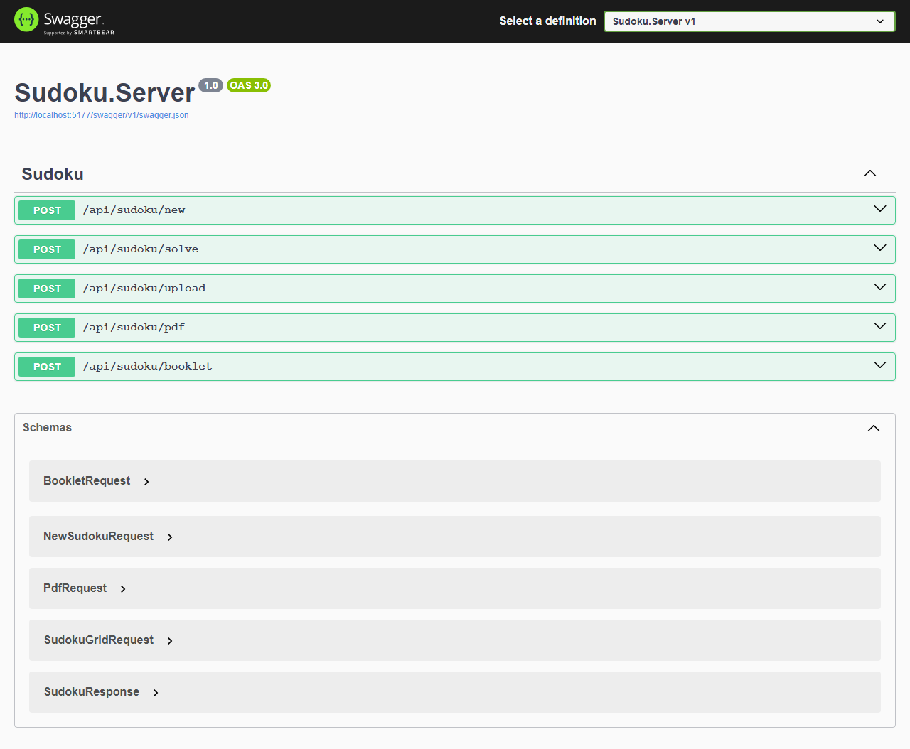

# SudokuWeb

A web application for creating, solving, and printing Sudoku puzzles. The project includes an ASP.NET Core server, a static frontend, and a shared Sudoku engine.

## Screenshots

### Home — empty board



### Side menu — controls & difficulty



### New puzzle



### Solved puzzle



### Swagger API (Development)



## Features

- **New puzzle** — generate a board by difficulty (`normal`, `mid`, `easy`, `very easy`)
- **Solve** — solve a 9×9 board entered manually or loaded from the server
- **Upload** — load a board from a `.txt` / `.csv` file (81 digits, `0` = empty cell)
- **PDF** — download a single puzzle as a PDF file
- **Booklet** — generate a PDF with 1–15 Sudoku puzzles
- **Swagger** — interactive API docs in Development mode

## Requirements

- [.NET 8 SDK](https://dotnet.microsoft.com/download/dotnet/8.0)

## Getting started

From the `SudokuWeb` folder:

```bash
dotnet run --project Sudoku.Server
```

Or open `SudokuWeb.sln` in Visual Studio and run the `Sudoku.Server` project.

| Profile | URL |
|---------|-----|
| HTTP | http://localhost:5161 |
| HTTPS | https://localhost:7189 |
| Swagger (Development) | `/swagger` |
| Web UI | `/` |

## Project structure

```
SudokuWeb/
├── SudokuWeb.sln          # Solution file
├── Core/
│   └── Sudoku.cs          # Sudoku engine logic
├── docs/
│   └── screenshots/       # README screenshots
└── Sudoku.Server/         # ASP.NET Core server
    ├── Program.cs
    ├── Controllers/
    │   └── SudokuController.cs
    ├── Services/
    │   ├── SudokuService.cs   # Create, solve, parse files
    │   └── PdfService.cs      # PDF generation (QuestPDF)
    ├── Models/
    │   └── SudokuModels.cs
    └── wwwroot/           # Frontend (HTML / CSS / JS)
        ├── index.html
        ├── css/site.css
        └── js/app.js
```

`Core/Sudoku.cs` is linked into the server project via `<Compile Include>` — there is no separate Core project.

## API

Base route: `/api/sudoku`

| Method | Route | Description |
|--------|-------|-------------|
| POST | `/new` | Create a new Sudoku puzzle |
| POST | `/solve` | Solve a 9×9 grid |
| POST | `/upload` | Upload a file (`multipart/form-data`, field `file`) |
| POST | `/pdf` | Download a single puzzle as PDF |
| POST | `/booklet` | Download a booklet PDF (1–15 puzzles) |

### Examples

**New puzzle (easy difficulty):**

```json
POST /api/sudoku/new
{ "difficulty": "easy" }
```

**Solve:**

```json
POST /api/sudoku/solve
{
  "grid": [
    [5,3,0,0,7,0,0,0,0],
    ...
  ]
}
```

**Booklet:**

```json
POST /api/sudoku/booklet
{ "count": 5, "difficulty": "mid" }
```

### Response (`SudokuResponse`)

```json
{
  "puzzle": [[...]],
  "solution": [[...]],
  "solved": true
}
```

## Difficulty levels

| Value | Description |
|-------|-------------|
| `null` / `normal` | Full board (default) |
| `mid` | Medium |
| `easy` | Easy |
| `veryeasy` | Very easy |

## Upload file format

- 81 digits (`0`–`9`), row by row
- `0` = empty cell
- Whitespace and non-digit characters are ignored
- Supported extensions: `.txt`, `.csv`

## NuGet dependencies

| Package | Purpose |
|---------|---------|
| QuestPDF | PDF generation |
| Swashbuckle.AspNetCore | Swagger / OpenAPI |

## Sudoku engine

Game logic lives in `Core/Sudoku.cs` and includes board generation, validation, backtracking solver, and difficulty presets.

## Regenerating screenshots

If the UI changes, run the app and capture fresh screenshots:

```bash
dotnet run --project Sudoku.Server --urls "http://localhost:5177"
cd docs
npm install playwright
npx playwright install chromium
SUDOKU_URL=http://localhost:5177 node capture-screenshots.mjs
```

Screenshots are saved to `docs/screenshots/`.
